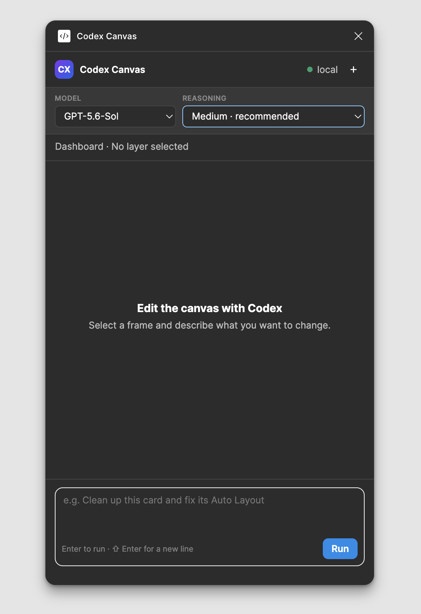

# Codex Canvas for Figma

Codex Canvas embeds a local Codex client in Figma and gives it direct access to the open document through the Figma Plugin API.

It does **not** call the hosted Figma MCP connector, so it does not consume that connector's tool-call allowance—effectively bypassing any Figma MCP tool-call limits on your account. Normal Codex usage still applies through the local `codex app-server` process.

<p align="center">
  
</p>

## What it can do

- Read the current selection and layer hierarchy.
- Create, edit, move, reparent, clone, or delete Figma nodes.
- Work with Auto Layout, text, fonts, fills, strokes, effects, components, instances, styles, variables, images, and the viewport through the Plugin API.
- Render the edited node as PNG so Codex can visually verify the result.
- Keep each coherent edit in Figma's Undo history.
- Stream the Codex conversation inside the plugin panel.
- Choose any picker-visible Codex model and one of its supported reasoning efforts; the selection is saved locally and applies from the next message.

Figma does not allow plugins to run in the background. Codex Canvas must remain open while Codex is working. Figma also does not expose file permissions, comments, team location, or the complete version-history interface to plugins.

## Development setup

Requirements:

- Figma desktop app.
- Node.js 20 or newer.
- A working, authenticated `codex` CLI installation.

The bridge first looks for `codex` in `PATH`, then in common macOS locations and inside installed OpenAI VS Code/Cursor extensions. If automatic discovery is not possible, provide the executable explicitly:

```bash
CODEX_BIN=/absolute/path/to/codex npm start
```

Install and build:

```bash
npm install
npm run check
npm run build
```

Start the local bridge and keep this terminal open:

```bash
npm start
```

Then, in the Figma desktop app:

1. Open a design file where your account has edit access.
2. Go to **Plugins → Development → Import plugin from manifest…**.
3. Select this project's `manifest.json`.
4. Run **Plugins → Development → Codex Canvas**.
5. Paste the connection token printed by `npm start`. It is stored locally by `figma.clientStorage`, so this is normally needed only once.

The bridge is reached by the plugin at `ws://localhost:3845` and binds only to the local loopback interface. Its token lives in `.runtime/token`, is ignored by Git, and is required by every Figma connection.

## Architecture

```text
Figma plugin panel
        │ WebSocket on localhost, token authenticated
        ▼
Local bridge ─── Codex App Server over stdio
        │
        └── client-executed dynamic tools
                    │
                    ▼
             Figma Plugin API
```

The App Server thread runs with a read-only filesystem sandbox. Design mutations are possible only through the client-executed Figma tools.

## Security and autonomy

The `execute` tool intentionally allows Codex to run an async JavaScript body against the Figma Plugin API. This is what provides broad layout-editing power without depending on a small fixed command list.

The boundary is deliberately local:

- the bridge listens on loopback only;
- every WebSocket connection requires a random token;
- the plugin manifest permits only the local development socket;
- scripts run inside Figma's plugin sandbox, not as operating-system shell commands;
- a failed script is rolled back to the preceding Undo checkpoint when possible.

If the Figma runtime blocks dynamic JavaScript construction, Codex automatically falls back to the eval-free `execute_ops` tool. It can reflectively call public Plugin API methods, set properties, resolve nodes, and pass object references across a batch.

Use the plugin only in files where you are comfortable allowing Codex to make direct edits. Figma's normal Undo remains available.

### Data and privacy

Local-first does not mean offline. The bridge, its authentication token, and the Figma control connection stay on your computer. However, the authenticated Codex service processes your chat prompts and any Figma context requested during a task, which can include node metadata, tool results, and rendered previews of the canvas. That data is handled according to the settings and policies of the OpenAI account used by your local `codex` CLI.

Codex Canvas does not operate a separate hosted backend and does not send data to the hosted Figma MCP connector.

## Current implementation note

Codex App Server's client-executed `dynamicTools` API is currently experimental. The bridge isolates that protocol in `src/bridge/index.ts`, so it can later be replaced with a stable local MCP transport without changing the Figma plugin or using the hosted Figma connector.

## License

[MIT](LICENSE)
